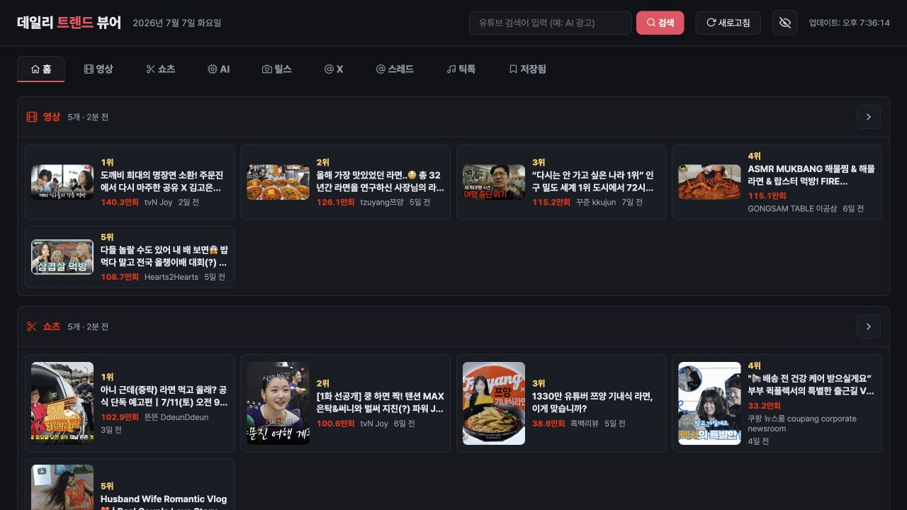
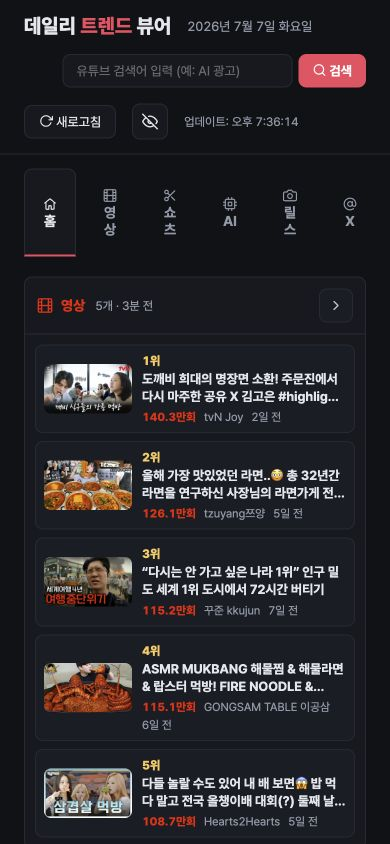

# trend-viewer

유튜브, 쇼츠, 릴스, X, 스레드, 틱톡, AI 모델/뉴스를 한 화면에서 보는
로컬 트렌드 뷰어입니다.

브라우저 탭을 여러 개 열지 않아도 됩니다. `python3 src/main.py`로 켜고,
`http://localhost:8779`에서 오늘 볼 만한 흐름을 바로 훑어보세요.

첫 화면은 홈(브리핑) 탭입니다. 플랫폼별 인기 항목을 5개씩 모아
아침 1분 안에 전체 흐름을 훑을 수 있습니다.



모바일 폭에서도 같은 화면을 좁게 정리해서 보여줍니다.



## 무엇을 해결하나요

트렌드는 플랫폼마다 다르게 보입니다.

유튜브는 조회수, 기간, 카테고리가 중요합니다. 릴스와 틱톡은 계정 흐름을
같이 봐야 합니다. X와 스레드는 텍스트 맥락과 링크가 중요합니다.
`trend-viewer`는 이 흐름을 로컬 브라우저 한 장에 모읍니다.

로그인 정보는 서버로 보내지 않습니다. 계정 목록과 캐시는 이 기기 안의
파일로 관리합니다. 인스타그램과 스레드처럼 비로그인 접근이 자주 막히는
플랫폼은 공개 수집을 먼저 시도하고, 막히면 바로가기 폴백을 보여줍니다.

## 바로 실행하세요

추가 패키지 설치는 필요하지 않습니다. Python 표준 라이브러리만 사용합니다.

```bash
python3 src/main.py
```

실행 후 브라우저에서 엽니다.

```text
http://localhost:8779
```

포트를 바꾸고 싶으면 이렇게 실행합니다.

```bash
TREND_VIEWER_PORT=8780 python3 src/main.py
```

## 볼 수 있는 것

- 홈: 모든 플랫폼의 상위 항목을 한 화면에 모은 데일리 브리핑
- 영상: 유튜브 인기 영상, 카테고리, 기간, 검색어, 정렬
- 쇼츠: 유튜브 쇼츠 중심 보기
- AI: AI 영상 모델과 관련 뉴스
- 릴스: 인스타그램 공개 프로필 수집, 막히면 계정 바로가기
- X: syndication API 기반 계정 타임라인
- 스레드: GraphQL 수집 시도, 막히면 계정 바로가기
- 틱톡: 공개 API 기반 트렌딩/계정 피드
- 저장됨: 카드의 북마크 아이콘으로 담은 항목을 모아 보는 탭
- 공통: 1시간 캐시, 이미지 프록시, 반응형 UI

## 쓰다 보면 편한 것들

매일 여는 도구라서 반복 사용에 필요한 장치를 넣었습니다.

- 카드마다 북마크 버튼이 있습니다. 누르면 저장됨 탭에 모입니다.
- 각 탭 상단에 수집 시각이 보입니다. 평소에는 1시간 캐시를 쓰고,
  수집에 실패한 항목은 더 짧게 캐시해서 새로고침 시 빨리 재시도합니다.
- 수집이 실패하면 빈 화면 대신 이유를 보여줍니다. 예를 들어 X가
  요청 제한(429)에 걸리면 몇 개 계정이 실패했는지 알려줍니다.
- 한 번 클릭한 카드는 살짝 어두워져서 이미 본 항목을 건너뛰기 쉽습니다.
  헤더의 눈 모양 버튼으로 표시를 지울 수 있습니다.
- 숫자 키 `1`~`9`로 탭을 바꾸고, `/`로 검색창에 바로 이동합니다.
- 탭과 필터 상태가 주소(hash)에 남아서 새로고침해도 보던 화면이 유지됩니다.

## 계정 목록을 넣으세요

계정 기반 피드를 보려면 `config/*_accounts.json` 파일을 만듭니다.
이 파일들은 개인 설정이라 git에 올리지 않습니다.

예시는 아래와 같습니다.

```json
[
  "xazinga",
  "openai"
]
```

| 플랫폼 | 파일 |
| --- | --- |
| 릴스 | `config/reels_accounts.json` |
| X | `config/x_accounts.json` |
| 스레드 | `config/threads_accounts.json` |
| 틱톡 | `config/tiktok_accounts.json` |

## 업데이트 방법

새 버전을 받으려면 프로젝트 폴더에서 아래 한 줄이면 됩니다.

```bash
git pull
```

`config/` 안의 계정 목록과 저장 항목은 git이 추적하지 않는 개인 파일이라
업데이트해도 그대로 유지됩니다. 받은 뒤에는 서버를 껐다가 다시 켜 주세요.

## 프로젝트 구조

원본은 `_upstream/`의 단일 파일 프로토타입입니다. 현재 버전은 같은 기능을
기능별 모듈로 나눠 포팅한 구조입니다.

```text
src/
├── main.py          # HTTP 서버, 라우팅, 정적 HTML 제공
├── settings.py      # 포트, 경로, 캐시, 이미지 프록시 허용 도메인
├── frontend/        # 단일 HTML/CSS/JS 프론트엔드
├── shared/          # HTTP, 캐시, 계정, 이미지 프록시, 저장 항목
├── youtube/         # 유튜브 영상/쇼츠 수집
├── reels/           # 인스타 릴스 수집
├── x_twitter/       # X 타임라인 수집
├── threads/         # 스레드 수집과 폴백
├── tiktok/          # 틱톡 수집
└── ai_news/         # AI 모델/뉴스 수집
```

Python import 규칙 때문에 폴더명은 `snake_case`를 씁니다. 각 기능은
`*_tool.py`와 `test_*.py`를 같은 폴더에 둡니다.

## 확인 방법

테스트는 `unittest`로 실행합니다.

```bash
python3 -m unittest discover -s src -p 'test_*.py'
```

README의 스크린샷은 로컬 서버를 띄운 뒤 실제 앱 화면을 캡처한 이미지입니다.

## 함께 만든 사람

이 저장소는 `xazingatrend` 조직에서 공개 관리합니다. 원본 아이디어와 운영
맥락은 `xazinga` 쪽에서 출발했고, 현재 포팅과 정리는 GitHub 저장소 기준으로
관리합니다.

| 역할 | 이름 |
| --- | --- |
| 원본 아이디어/운영 맥락 | `xazinga` |
| 운영 연락 | `geonu0812@gmail.com` |
| GitHub 조직 | [`xazingatrend`](https://github.com/xazingatrend) |
| GitHub contributor | [`lidge-jun`](https://github.com/lidge-jun) |
| Git 커밋 작성자 | `bitkyc08-arch <bitkyc08@gmail.com>` |

GitHub의 contributor 그래프는 커밋 작성자와 GitHub 계정 매핑을 기준으로
자동 계산됩니다. 새 기여자는 커밋이 들어오면 GitHub 화면에도 자동으로
반영됩니다.

## 더 읽을 문서

- 포팅 계획: `devlog/_plan/010_porting-plan.md`
- 프론트엔드 정책: `devlog/_plan/020_frontend-policy.md`
- jaw-marketing 비교 분석: `devlog/_plan/090_jaw-marketing-analysis.md`
- 기능별 구조 문서: `devlog/str_func/`
- 완료된 작업 로그: `devlog/_fin/`

## 변경 기록

- 2026-07-07: 홈 브리핑 탭, 저장됨 탭, 캐시 나이 표시, 수집 실패 표시,
  본 항목 흐리기, 키보드 단축키, 해시 상태 복원, 모바일 한 줄 탭 추가
- 2026-07-07: 업데이트 방법(git pull) 안내와 홈 브리핑 스크린샷 추가
- 2026-07-07: README에 운영 주체와 전체 contributor 정보를 추가
- 2026-07-07: README 문체를 한국어 UX writing 기준으로 조정
- 2026-07-07: `xazingatrend/trend-viewer` 초기 공개용 README와 실제 앱 스크린샷 추가
- 2026-07-07: 단일 파일 프로토타입을 stdlib 기반 feature 구조로 포팅
